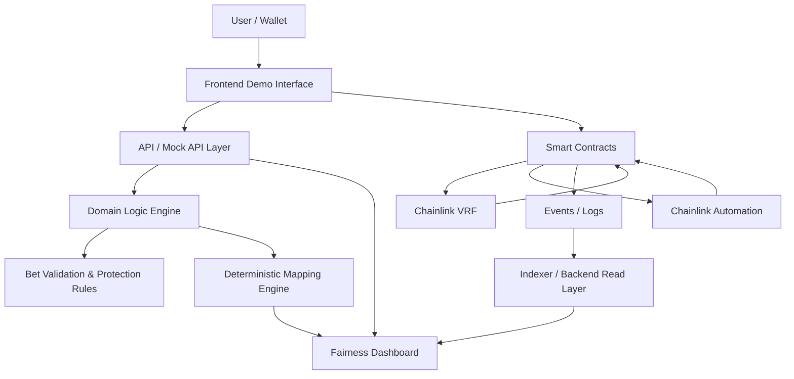

# ZodiacChain — Technical Architecture Overview

**Version:** 1.0  
**Status:** Draft  
**Project:** ZodiacChain  
**Phase:** Testnet MVP / Public Demonstration  
**Network Target:** Polygon Amoy Testnet  
**Core Integrations:** Chainlink VRF, Chainlink Automation  

---

## 1. Purpose

This document provides a high-level technical overview of the ZodiacChain MVP architecture.

ZodiacChain is designed as a testnet-first verifiable draw infrastructure. The MVP focuses on demonstrating how a draw can move through a transparent lifecycle, request verifiable randomness, derive deterministic outcomes, and expose the full verification path through a Fairness Dashboard.

This document is intended for:

- grant reviewers
- technical contributors
- future Web3 frontend/backend engineers
- smart contract developers
- ecosystem partners
- public documentation readers

---

## 2. Architecture Summary

The ZodiacChain MVP is composed of the following layers:

1. **Frontend / Demo Interface**
2. **API / Mock API Layer**
3. **Domain Logic Engine**
4. **Smart Contract Layer**
5. **Chainlink VRF Randomness Layer**
6. **Chainlink Automation Layer**
7. **Event / Indexing Layer**
8. **Fairness Dashboard**

The first MVP implementation may use mock data and TypeScript domain logic before replacing parts of the flow with live smart contract and Chainlink testnet integrations.

---

## 3. High-Level Architecture Diagram

---

##4. Main Components
 ###4.1 Frontend / Demo Interface

 The frontend is the public-facing interface of the MVP.

 It allows users and reviewers to:

  - view the active draw
  - understand the draw lifecycle
  - simulate or place testnet bets
  - see draw results
  - inspect the Fairness Dashboard
  - follow verification steps
  - access public transaction references when available

The frontend should clearly state that the MVP is testnet-only and does not support real-money operation.

 ###4.2 API / Mock API Layer

 The API layer provides structured data to the frontend.

 During the early MVP phase, this layer may return mock data to allow the frontend and user flow to be developed before live smart contract integration.

 Expected responsibilities:

  - return active draw data
  - return bet type configuration
  - calculate quote responses
  - validate bet payloads
  - return result data
  - return fairness dashboard data
  - expose event history
  - expose protection summaries

 Example API groups:

  - /draws
  - /bet-types
  - /bets
  - /wallets
  - /fairness
  - /events
  - /randomness
