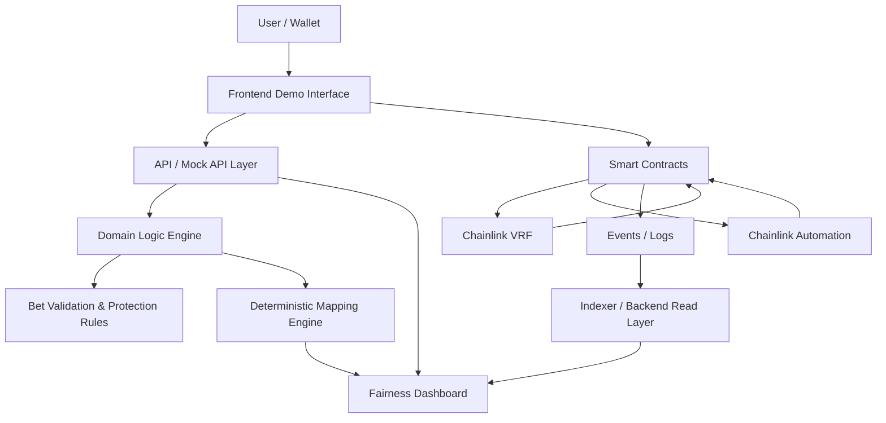
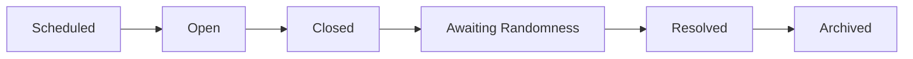
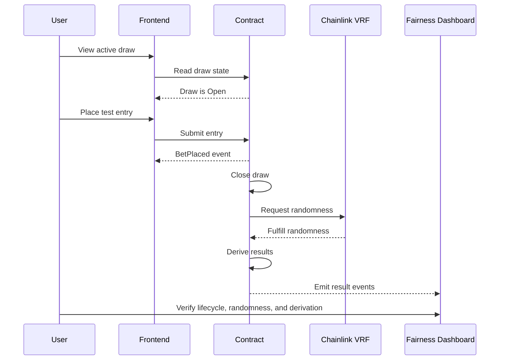

# ZodiacChain — Technical Architecture Overview

**Version:** 1.0  
**Status:** Public Documentation  
**Repository:** `zodiacchain-docs`  
**Project Phase:** Testnet MVP / Public Demonstration  
**Target Network:** Polygon Amoy Testnet  
**Core Integrations:** Chainlink VRF, Chainlink Automation  

---

## 1. Overview

ZodiacChain is designed as a **testnet-first verifiable draw infrastructure**.

The MVP demonstrates how a draw can move through a transparent lifecycle, request verifiable randomness, derive deterministic outcomes, and expose the full verification path through a public **Fairness Dashboard**.

The goal of this architecture is not to launch a real-money betting platform in the initial phase. The goal is to prove that the core draw engine can be:

- transparent;
- deterministic;
- auditable;
- verifiable;
- testnet-ready;
- understandable for grant reviewers and future contributors.

---

## 2. Architecture Goals

The MVP architecture is designed to support five core goals:

| Goal | Description |
|---|---|
| Verifiable randomness | Use Chainlink VRF as the randomness source for draw resolution |
| Deterministic mapping | Convert random outputs into public results using fixed formulas |
| Lifecycle transparency | Show every draw state from scheduling to archival |
| Public auditability | Expose events, timestamps, request references, and result derivation |
| Testnet-first delivery | Demonstrate the system safely before any production or real-money phase |

---

## 3. High-Level Architecture



---

## 4. Main Architecture Layers

| Layer | Responsibility |
|---|---|
| Frontend Demo Interface | User-facing MVP screens and draw visualization |
| API / Mock API Layer | Provides structured data to the frontend before full contract integration |
| Domain Logic Engine | Implements deterministic rules, validation, payout, and mapping logic |
| Smart Contract Layer | Manages on-chain draw lifecycle and future VRF integration |
| Chainlink VRF | Provides verifiable randomness for draw resolution |
| Chainlink Automation | Supports automated lifecycle execution |
| Event / Indexing Layer | Captures lifecycle and result events for auditability |
| Fairness Dashboard | Explains and verifies the full draw process publicly |

---

## 5. Frontend Demo Interface

The frontend is the main public entry point for the MVP.

It should allow users and reviewers to:

- view the active draw;
- understand the current lifecycle state;
- simulate or place testnet entries;
- view final draw results;
- inspect the Fairness Dashboard;
- follow the verification path;
- access transaction or explorer references when available.

The frontend must clearly state:

> Testnet MVP only. No real-money operation.

---

## 6. API / Mock API Layer

The API layer provides structured data to the frontend.

During the early MVP phase, this layer may use mock data so the frontend and user experience can be built before full smart contract integration.

Expected API responsibilities:

- return active draw data;
- return supported bet types;
- calculate quote responses;
- validate testnet entries;
- return draw results;
- return fairness records;
- expose event history;
- expose protection summaries.

Example API groups:

```text
/draws
/bet-types
/bets
/wallets
/fairness
/events
/randomness
```

---

## 7. Domain Logic Engine

The Domain Logic Engine contains the core deterministic rules of ZodiacChain.

Initially, this logic should be implemented in TypeScript to validate the business rules before mirroring critical parts into Solidity.

Main responsibilities:

- derive Terrestrial Result;
- derive Celestial Number;
- map numbers to animals and elements;
- validate bet types;
- calculate win/loss;
- calculate simulated payouts;
- apply protection rules;
- support QA test scenarios.

---

## 8. Smart Contract Layer

The smart contract layer is responsible for the on-chain foundation of the MVP.

Initial responsibilities:

- store draw state;
- manage lifecycle transitions;
- store draw parameters;
- request randomness;
- receive randomness fulfillment;
- derive official results;
- emit public events;
- prevent invalid state transitions.

The smart contract should follow the defined lifecycle:

```text
Scheduled → Open → Closed → Awaiting Randomness → Resolved → Archived
```

The first implementation should begin with a contract scaffold. Full Chainlink VRF and Automation integration can be added after the core lifecycle is stable.

---

## 9. Chainlink VRF Layer

Chainlink VRF is responsible for providing verifiable randomness to the draw.

Expected flow:

1. The draw is closed.
2. The smart contract requests randomness.
3. A `requestId` is stored and linked to the draw.
4. Chainlink VRF fulfills the request.
5. The contract receives random words.
6. ZodiacChain derives public results from those random words.

Expected result outputs:

| Output | Range | Purpose |
|---|---:|---|
| Terrestrial Result | `00–99` | Used to derive the Terrestrial Animal |
| Celestial Number | `01–60` | Source of truth for Celestial Animal and Element |

---

## 10. Chainlink Automation Layer

Chainlink Automation is intended to support automated lifecycle execution.

Expected responsibilities:

- detect when an open draw should close;
- trigger lifecycle transition from `Open` to `Closed`;
- support the randomness request flow;
- reduce reliance on manual scripts;
- prevent duplicate lifecycle execution.

Automation-compatible logic should ensure that the same draw cannot be closed or resolved twice.

---

## 11. Event / Indexing Layer

Events are part of ZodiacChain’s transparency model.

The MVP should emit events for important lifecycle actions, including:

| Event | Purpose |
|---|---|
| `DrawScheduled` | Draw was created |
| `DrawOpened` | Draw started accepting entries |
| `BetPlaced` | Testnet entry was accepted |
| `BetRejected` | Entry was rejected by validation/protection rules |
| `DrawClosed` | Entry window was closed |
| `RandomnessRequested` | VRF randomness was requested |
| `RandomnessFulfilled` | VRF randomness was fulfilled |
| `DrawResolved` | Official results were derived |
| `BetSettled` | Testnet payout was calculated |
| `DrawArchived` | Draw was finalized as historical record |

These events allow the frontend, backend, indexer, QA process, and Fairness Dashboard to reconstruct what happened during a draw.

---

## 12. Fairness Dashboard

The Fairness Dashboard is the main public verification layer of ZodiacChain.

It should display:

- draw ID;
- lifecycle state;
- timestamps;
- VRF request ID;
- request and fulfillment references;
- Terrestrial Result;
- Celestial Number;
- derived animal and element mappings;
- protection rules snapshot;
- event timeline;
- explorer links when available.

The dashboard should help users answer:

> Was the draw locked before randomness was requested?

> Which randomness request resolved the draw?

> How were the final results derived?

> Can I inspect the public verification path?

---

## 13. Verifiable Draw Lifecycle



| State | Description |
|---|---|
| Scheduled | Draw exists but is not accepting entries yet |
| Open | Draw is accepting testnet entries |
| Closed | Entry window is closed |
| Awaiting Randomness | Randomness has been requested |
| Resolved | Results have been derived |
| Archived | Draw is finalized as historical record |

---

## 14. Randomness and Result Derivation

ZodiacChain derives two official outputs from randomness:

1. Terrestrial Result
2. Celestial Number

---

### 14.1 Terrestrial Result

The Terrestrial Result is a number from `00` to `99`.

```text
terrestrialResult = randomWordTerrestrial % 100
terrestrialAnimalId = floor(terrestrialResult / 4) + 1
```

This creates:

- 100 total numbers;
- 25 animals;
- 4 numbers per animal.

Example:

```text
07 → Animal 2
```

---

### 14.2 Celestial Number

The Celestial Number is a number from `01` to `60`.

```text
celestialNumber = (randomWordCelestial % 60) + 1
celestialAnimalId = ((celestialNumber - 1) % 12) + 1
celestialElementId = floor((celestialNumber - 1) / 12) + 1
```

The Celestial Number is the single source of truth for all Celestial outcomes.

Example:

```text
17 → Dragon + Fire
```

---

## 15. Protection Rules

The MVP includes protection rules to keep the draw bounded, explainable, and auditable.

Initial protection rules include:

| Rule | Purpose |
|---|---|
| Minimum bet | Prevent meaningless or spam entries |
| Maximum bet | Limit individual exposure |
| Daily wallet limit | Reduce repeated excessive activity |
| Cooldown | Prevent rapid repeated entries |
| Payout cap | Limit single payout exposure |
| Concentration cap | Prevent one selection from dominating the pool |
| Solvency check | Ensure demo reserve can cover projected payout |
| Immutable resolution window | Prevent changes after randomness request |

These protections are part of the transparency model. They explain why an entry may be accepted or rejected before draw resolution.

---

## 16. Public Verification Flow



The public verification path should make the following sequence visible:

```text
entries locked → randomness requested → randomness fulfilled → results derived → dashboard verification
```

---

## 17. MVP Architecture Scope

The MVP focuses on:

- public documentation;
- frontend demo;
- mock API / domain logic;
- draw lifecycle visualization;
- deterministic result derivation;
- Chainlink VRF integration planning;
- fairness dashboard;
- testnet-only public demonstration.

The MVP may begin with mocked data and progressively move toward live testnet integration.

---

## 18. Future Architecture Scope

Future phases may include:

- full smart contract deployment;
- live Chainlink VRF fulfillment;
- Chainlink Automation production-style lifecycle execution;
- complete event indexing;
- security audit;
- legal and regulatory review;
- production-grade frontend;
- external partner integrations;
- favorable-jurisdiction commercial planning.

---

## 19. Non-Goals

The MVP does not include:

- real-money operation;
- token presale;
- investment offering;
- production betting launch;
- regulated market launch;
- KYC/AML implementation;
- mainnet deployment;
- production treasury management.

Any future real-money phase would require legal review, jurisdictional planning, security audit, and compliance controls.

---

## 20. Repository Relationship

The current documentation repository should contain:

```text
zodiacchain-docs/
├── whitepaper/
├── grant/
├── roadmap/
├── architecture/
├── assets/
└── README.md
```

Future implementation repositories may include:

```text
zodiacchain-mvp/
zodiacchain-contracts/
```

The current architecture document describes the intended technical direction before implementation begins.

---

## 21. Summary

ZodiacChain’s MVP architecture is designed to prove one core idea:

> A draw can be transparent, verifiable, deterministic, and publicly auditable from lifecycle start to final result.

The architecture prioritizes:

- testnet-first delivery;
- Chainlink VRF-based randomness;
- deterministic mappings;
- visible protection rules;
- event-driven transparency;
- public fairness verification.

The goal is not to launch a real-money product immediately.

The goal is to build a credible, verifiable, grant-ready MVP foundation.
